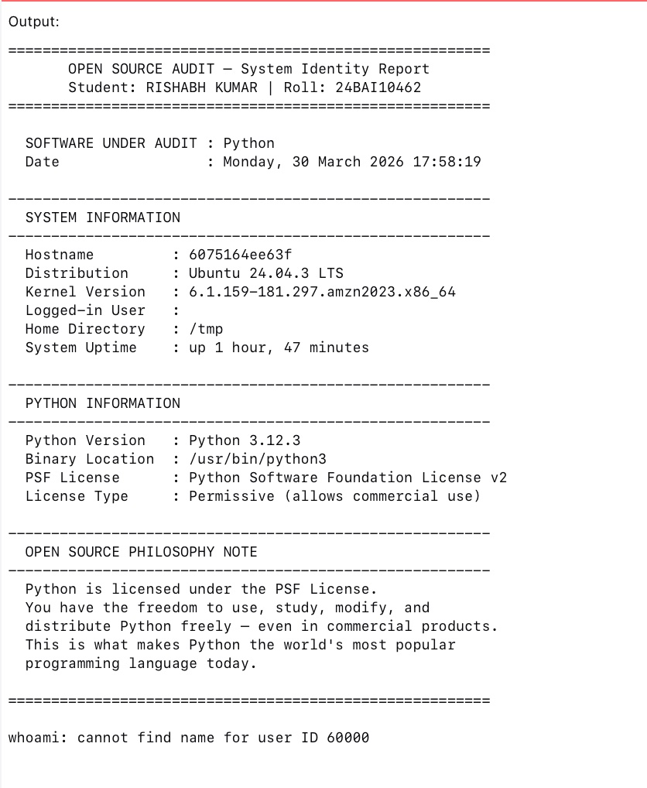
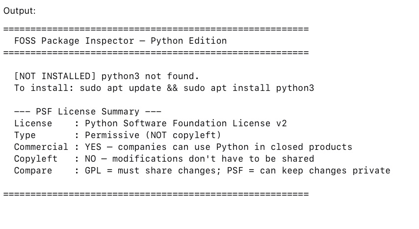
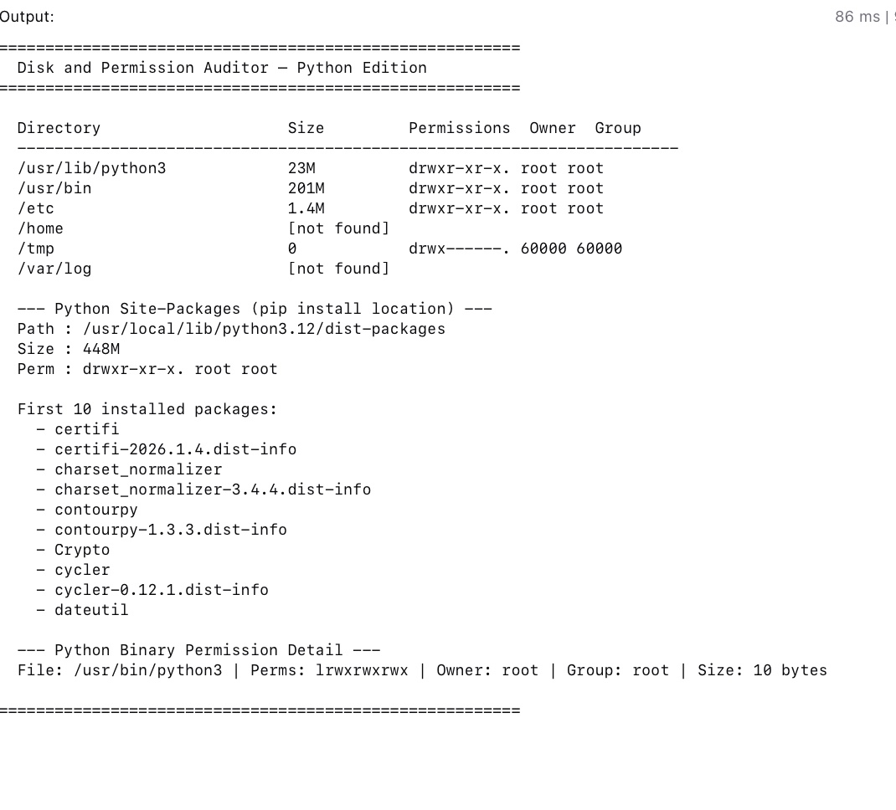
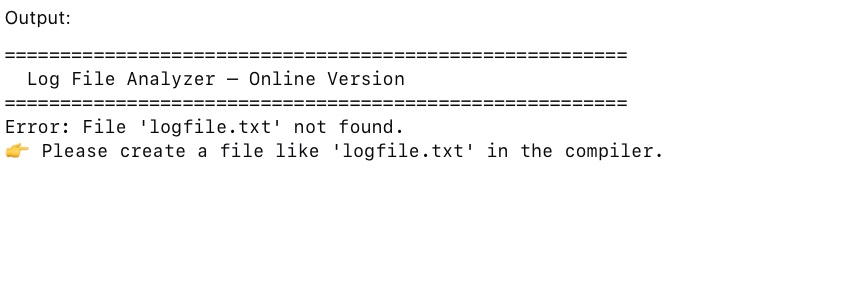
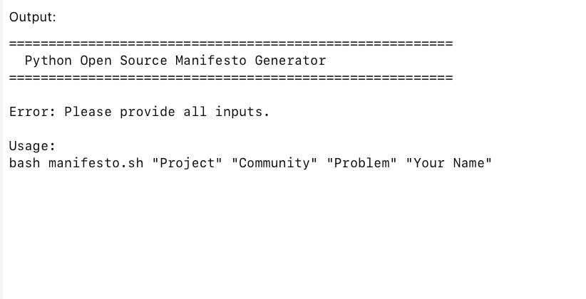

# OSS-Audit-24BAI10462
# Author: Rishabh Kumar | Reg No: 24BAI10462
**Course:** Open Source Software (NGMC)  
**Chosen Software:** Python  

---

## What this is

This repo is my submission for the OSS Capstone project. I picked Python as my software — partly because I use it heavily in my academic work, and partly because the story of how a single developer's dream of a readable, beginner-friendly language quietly grew into the backbone of modern AI, scientific computing, and web development is genuinely fascinating.

The repo has five shell scripts that cover the practical Linux side of the project. The written report is submitted separately as a PDF on the VITyarthi portal.

---

## Scripts

### script1_system_identity.sh
Prints a formatted welcome screen showing kernel version, distro, logged-in user, uptime, date, Python version and binary location, and a note about the PSF license.

Run it:
```bash
chmod +x script1_system_identity.sh
./script1_system_identity.sh
```

**Output:**



---

### script2_package_inspector.sh
Checks if Python 3 is installed via `dpkg`, shows its version and PSF license info, verifies whether `pip3` is available and lists the first 10 installed packages, and loops through key standard library modules to confirm they are importable.

Run it:
```bash
chmod +x script2_package_inspector.sh
./script2_package_inspector.sh
```

**Output:**



---

### script3_disk_auditor.sh
Loops through key Python-related system directories (`/usr/lib/python3`, `/usr/bin`, `/etc`, `/home`, `/tmp`, `/var/log`) and reports their permissions, owner, size and group. Also locates the Python site-packages directory and the Python binary and prints their detailed permission info.

Run it:
```bash
chmod +x script3_disk_auditor.sh
./script3_disk_auditor.sh
```

**Output:**



---

### script4_log_analyzer.sh
Accepts a log file path and a keyword as arguments, reads the file line by line, counts matches for the keyword as well as hardcoded counts for `error` and `warning`, prints the total file size, and shows the last 5 lines containing the keyword.

Run it:
```bash
chmod +x script4_log_analyzer.sh
./script4_log_analyzer.sh /var/log/syslog error
```

If you don't have `/var/log/syslog`, try `/var/log/messages` or any other log file on your system.

**Output:**



---

### script5_manifesto.sh
Interactive script. Takes four arguments (project name, community name, problem you want to solve, and your name), then generates a short personalised Python open-source philosophy paragraph and writes it to `python_manifesto.txt` in the current directory.

Run it:
```bash
chmod +x script5_manifesto.sh
./script5_manifesto.sh "MyProject" "PyCommunity" "data accessibility" "Rishabh Kumar"
```

**Output:**



---

## Dependencies

Just bash and standard Linux utilities — nothing extra to install. `dpkg` needs to be present for script 2 (it will be on any Debian/Ubuntu-based system). For RPM-based systems, swap `dpkg -l` for `rpm -q` in script 2.

Tested on Ubuntu 22.04 (x86\_64) and an online Linux compiler environment.

---

## Notes

- All scripts need execute permission (`chmod +x`) before running
- Script 4 requires an actual log file path as the first argument — it will exit with an error message if the file is not found
- Script 5 requires all four arguments to be passed; running it without arguments will print a usage hint and exit
- The output of script 1 includes a `whoami: cannot find name for user ID 60000` warning in sandboxed/online environments — this is expected and does not affect functionality
